# What is PINN (PINN Is Not NOOBS)?

**An easy enhanced Operating System installer for the Raspberry Pi**

The latest version of [PINN](http://downloads.sourceforge.net/projects/pinn/pinn-lite.zip) can be downloaded from [sourceforge](http://www.sourceforge.net/projects/pinn).

<sup>(PINN is only available in one format that does not include any operating systems at all. It is more akin to `NOOBS-lite` rather than `NOOBS`. For that reason, the filename that you download is called `pinn-lite.zip`)</sup>

## Index

* [Quick Start](#Quick-Start)
* [PINN User Interface](#PINN-User-Interface)
* [PINN Configuration](#PINN-Configuration)
* [Installing OSes](#Installing-OSes)
* [Booting an OS with PINN](#Booting-an-OS-with-PINN)
* [Other Features](#Other-Features)
* [Archival Menu](#Archival-Menu)
* [Maintenance Menu](#Maintenance-Menu)
* [Advanced Usage](#Advanced-Usage)
* [Troubleshooting](#Troubleshooting)
* [FAQ](#FAQ)
* [How to Rebuild PINN](#How-to-Rebuild-PINN)

# Introduction

## Features
- A multi Operating System (OS) installer
- An operating system selector
- A boot manager
- An OS maintenance utility:
  - A recovery shell 
  - SD card clone utility
  - Password restorer
  - File System Checker

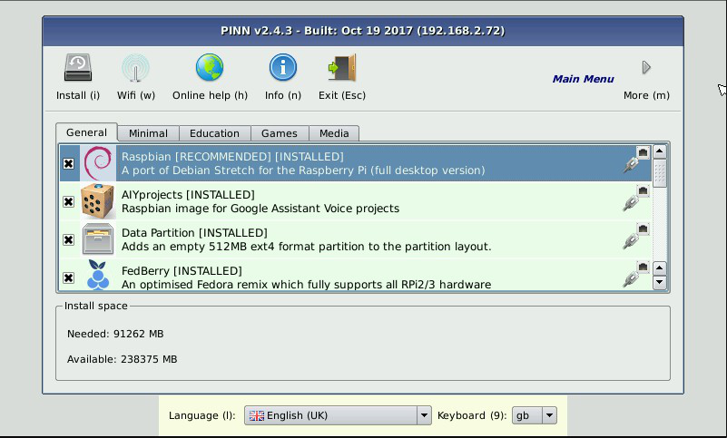

<sup>*NOTE: The list of OSes in this image is indicative only. It will vary according to your Raspberry Pi model and the availability of OSes on the installation sources.</sup>

## Benefits

PINN is designed to make it easy to select and install operating systems for the Raspberry Pi without having to worry about manually imaging your SD card. 

Once PINN is installed on your SD card, the installation of other OSes and a lot of the maintenance of them can mostly be done on the RPi itself without having to remove the SD card.

The list of OSes that can be installed by PINN is growing all the time, from general purpose Linux distros, through educational versions, media centres to retro gaming solutions. It is the ideal environment to experiment and try out new OSes.

PINN occupies just over 60MB of your precious SD card space, leaving the majority of the  card available for your OSes.

### General Operation

On first boot, PINN will format your SD card and allow you to select which OSes you want to install from a list. This OS list is automatically generated from locally available OSes (i.e. those contained in the `/os` directory on disk or an attached USB memory stick) and those available from a remote repository (network connection required).

Only the latest version of each OS will ever be displayed. So, you can be sure that you have installed the most up-to-date release of your selected OS.

On any subsequent boot, you can press the SHIFT key to enter the PINN interface and easily reinstall your choice of OSes. It is also possible to press the Left mouse button, press any key on a CEC enabled TV remote, or touch the Raspberry logo on the touchscreen to enter the PINN interface.

If no input is provided, PINN will proceed to the boot selection dialog. If only one OS installed it will booted immediately, otherwise a menu of installed OSes will be presented for one to be selected. If no choice is detected within a timeout period, the last booted OS, or a default OS will be chosen. 

It is also possible for PINN to be bypassed altogether and one of the OSes booted directly from startup. In this way it is not even noticeable that PINN is there, but it canbe reinstated simply by deleting a single file on the PINN partition.

## Requirements

- A Raspberry Pi with power supply (works with all models)
- A blank micro SD card (or SD card for an earlier Model 1 RPi). 8GB is the minimum recommended size. 16GB or larger is preferred, especially if you want to install locally from the SD card.
- (optional) A keyboard and mouse (unless you want to use it headlessly).
- (recommended) A network connection (unless you want to install OSes from a local source, but you'll need to download them somehow first!).
- (recommended) A USB uSD card reader is not required, but it is an essential bit of kit to allow a PC to format the uSD card, install PINN initially and general editing if something goes wrong.
- Access to NOOBS formatted OS distributions (via Internet or local memory device).
- [pinn-lite.zip](http://downloads.sourceforge.net/projects/pinn/pinn-lite.zip).

---
# Quick Start

The following Quick Start instructions detail the most common and quickest way to start using PINN. For more details on the other features that PINN provides, please continue reading the rest of this document.

## Format your SD card as FAT32

For **Windows** users, we recommend formatting your SD card using the SD Association's Formatting Tool, which can be downloaded from https://www.sdcard.org/downloads/formatter_4/ .
If you are still using v4 of this tool, you will need to set the "FORMAT SIZE ADJUSTMENT" option to "ON" in the "Options" menu to ensure that the entire SD card volume is formatted - not just a single partition. However, this tool has now been upgraded to v5 where this feature is now the default and is no longer selectable. For more detailed and beginner-friendly formatting instructions, please refer to http://www.raspberrypi.org/quick-start-guide .

The SD Association's Formatting Tool is also available for <b>Mac</b> users. However, note that the default OSX Disk Utility is also capable of formatting the entire disk (select the SD card volume and choose "Erase" with "MS-DOS" format).

For **Linux** users, we recommend `gparted` (or the command line version `parted`). (Update: Norman Dunbar has written up the following formatting instructions for Linux users: http://qdosmsq.dunbar-it.co.uk/blog/2013/06/NOOBS-for-raspberry-pi/)

## Copy the PINN files to your SD card.

- Download **[pinn-lite.zip](http://sourceforge.net/projects/pinn/files/pinn-lite.zip)** from [sourceforge](http://www.sourceforge.net/projects/pinn)
- Extract the files from pinn-lite.zip file onto the SD card. (Windows built-in zip features may have trouble with this file. If so, use another program such as 7zip.) **In some cases, the files may be extracted into a folder. If this is the case, please copy the files from inside the folder rather than copying the folder itself.**

## Boot PINN on your PI
- Put the PINN SD card into your Pi and boot it.
- On first boot the "RECOVERY" FAT partition will be automatically resized to a minimum, so if you ever put your SD card back into a Windows machine it will look like a very small partition. THIS IS NORMAL.
- PINN does not come supplied with any OSes. You must download them from the internet or provide them on a USB stick. So,....
- Connect your Pi to the internet with an Ethernet cable (easiest)
- Or If you prefer to use Wifi, click on the wifi button and select your SSID and password. If the wifi button is greyed out, choose another type of wifi dongle.
- A list of OSes that are available to install will be displayed.
- Select one or more OSes that you want and click INSTALL.

## Self Update

If PINN is connected to the Internet, it will check for the latest version available for download. If a newer version is available, a dialog box will pop up, showing the latest version number and the recent changes. You then have the option to cancel the update, download it, or ignore this version.
If you cancel the update, the dialog box will keep popping up to remind you each time PINN starts.
If you select "ignore", this version will be ignored and no dialogs will pop up again until another later version is released.
If you choose to download this update, the zip file will be downloaded and will overwrite your current version of PINN. PINN will then reboot the RPi and restart PINN.

---

# PINN User Interface

The PINN user interface is kept fairly simple, comprising a switchable toolbar of command buttons, a list of installable operating systems and a status window indicating the capacity of appropriate attached memory devices. At the bottom of the screen is a small display customisation dialog that permits changing the language and keyboard layout of the user interface.

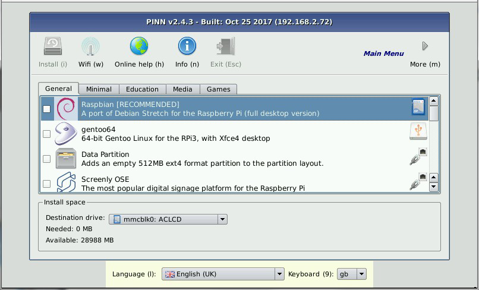

## Toolbars

There are three toolbars:

- **Main Menu**
  - **Install**: Installs the selected OSes onto your SD card. Changing this selection erases all OSes that are currently installed.
  - **Wifi**: configures the wifi.
  - **Help**: [Networking Required] Opens a browser that displays the Raspberry Pi Help page (http://www.raspberrypi.org/help/), allowing people to quickly access help and troubleshooting information.
  - **Info**: [Networking Required] Opens a browser that displays the webpage for the selected OS.
  - **Exit**: Quits PINN and reboots the Pi into the OS boot menu.
- **Archival**
  - **Download**: Downloads an OS for offline installation.
  - **Clone SD**: Clones the SD to another card.
  - **Info**: [Networking Required] Opens a browser that displays the webpage for the selected OS.
- **Maintenance**
  - **Edit Config**: Opens a text editor, allowing the `cmdline` and `config` files for the selected installed OS to be edited.
  - **Password**: Allows the password of an OS to be restored or replaced.
  - **Fsck**: Checks the file systems on the partitions of the selected installed OSes.
  - **Wipe**: Restores the drive to its original size and deletes all installed OSes.
  - **Info**: [Networking Required] Opens a browser that displays the webpage for the selected OS.

The `more` button can be used to cycle through the 3 toolbars.

## Main OS List Window

Beneath the toolbar is the main list of Operating Systems which displays the name and a short description of each OS. At the right hand side is an icon indicating the source where the latest version will be installed from (Internet, SD card or USB drive).

OSes are grouped onto tabs which categorise the type of OS they are. This grouping includes the following categories: General, Media, Gaming, Education & Minimal. To avoid this grouping, specify **`no_group`** on recovery.cmdline and the OSes will all appear in one list.

Each OS has a checkbox at the left hand side to select whether it will be installed or not. When PINN is booted with OSes already installed, these OSes will have their checkbox automatically ticked and their background will also be light green in colour, along with the word **[installed]** next to their name. Note that installed OSes may be selected in multiple tabs.

When the **Maintenance** toolbar is selected, this list will change to only show the list of OSes that are already installed, since the toolbar buttons are only relevent to installed OSes.

## Status Window

Below the main OS List Window is a status window indicating the capacity of appropriate attached memory devices.

On the **Main Menu**, this status window will show the space on the SD card that is available to install OSes, along with the amount of required space for the selected OSes. If a USB drive is inserted, a drop down selection box will appear to change the install device from the SD card to the USB device. You will be prompted to format the USB drive if it is not already formatted in the correct way for a PINN installation.

On the **Archival** menu, this status window will change to show the amount of available and required space on the USB drive for downloading OSes to. Such a USB drive will only be selectable if it has an /os folder on its first partition to store OSes on.

On the **Maintenance** menu, this status window will not appear.

## Display Customisation


In addition to the toolbars, the following functionality is provided:
 - <b>Language Selection</b>: Allows you to select the language used for text display.
 - <b>Keyboard Layout Selection</b>: Allows you to select the keyboard layout to be used.
 - <b>Display Mode Selection</b>: By default, PINN will output over HDMI at your display's preferred resolution, even if no HDMI display is connected. If you do not see any output on your HDMI display or are using the composite output, press 1, 2, 3 or 4 on your keyboard to select HDMI preferred mode (1), HDMI safe mode (2), composite PAL mode (3), or composite NTSC mode (4), respectively.

Note that all user settings (language, keyboard layout, display mode) will persist between reboots and will also be automatically passed to the installed OSes. This means that if you can see the PINN interface on your display device, you should be able to see the OS CLI/GUI when it boots too.

## User Control

### Mouse & Keyboard

If you are using the RPi locally, the majority of the program can be used with a mouse alone, although a keyboard can make it easier. A keyboard is required to enter the wifi credentials if you want to connect to a network that way. However, the wifi can be preconfigured to avoid even this use.

### CEC Control (v2.1.1 onwards)

PINN can be controlled with a TV remote, if the HDMI TV has CEC support.
The CEC remote keys are mapped as follows:

To simulate a mouse the following keys are used:
- Cursor Up/Down/Left/Right - moves the mouse cursor in each direction
- Select - mouse click

For quicker selection, the following keys may be easier:
- Channel Up - previous list item
- Channel Down - next list item
- PLAY key - Enter Key
- Exit Key - Escape
- 9 key - Changes the toolbar
- 1-8 keys - select the menu buttons numbered from left to right

Any of the above remote keys can be used instead of the keyboard shift key on startup to access the main menu.

There is no onscreen keyboard in PINN, so a local keyboard will be needed to enter wifi credentials, unless the wifi is preconfigured.

**NOTE: CEC implementations vary between TV manufacturers. The above key mappings work on Samsung TVs supporting their Anynet+. Other TV brands may not work as well, but the mouse simulation is designed to work on most TVs.
If your TV does not work as above and you are willing to help debug the problem, please let me know so I can identify the differences and include support for your brand of TV.**

### How to use with the Raspberry Pi Touch Display

If PINN detects you are using the [Raspberry Pi Touch Display](https://www.raspberrypi.org/products/raspberry-pi-touch-display/), it will enable the following functionality:
- A tap on the touchscreen on the Raspberry logo (or holding down the shift key) can activate PINN.
- A tap on the touchscreen will simulate a mouse click.
- A long press on the touchscreen will simulate a mouse double-click.

There is no onscreen keyboard in PINN, so a local keyboard will be needed to enter wifi credentials, unless the wifi is preconfigured.

### How to use with Gert's VGA666 DPI display screen

The VGA666 adaptor connects to the GPIO pins and allows a VGA display to be attached to the RPi. The normal VGA666 installation instructions should be followed to allow it to work with PINN.

Create a config.txt file with the following lines in it:
```
dtoverlay=VGA666
enable_dpi_lcd=1
display_default_lcd=1
dpi_group=<group> (e.g. dpi_group=1, or dpi_group=2)
dpi_mode=<mode> (e.g. dpi_mode=28 - see tvservice for a list of possible modes)
```
In addition, the `recovery.cmdline` file should have `disablesafemode` added as a parameter. Without it, the VGA666 will force PINN into safe mode, due to its connections to the GPIO header.

### How to use PINN Headlessly (VNC)

It is possible to access PINN without a keyboard and mouse using VNC over a network.

Append `vncinstall` to the argument list in the `recovery.cmdline` file which is found in the root PINN directory. Using `forcetrigger` in addition can be useful as it is not always easy to connect quickly enough to see the splash screen and hold the shift key remotely. This will force you to use VNC to continue the boot process into your installed OS on each boot, so it is best to remove `forcetrigger` once the required OS's have been installed. Alternatively you could use `gpiotriggerenable` (see later).

To connect over VNC, you need to know the IP address of the Pi. If you are using DHCP, then you should see your router for a list of the devices connected to it and the IP addresses that have been assigned, or use an IP scanner like Fing to identify your device. If you have a monitor attached and are using `vncshare`, the IP address of the PI is shown in the window title bar for ease of connection. Connect to port 5900 of this IP address. Using tightvnc, you need to specify this as <ip address>:5900 e.g. 192.168.1.0:5900.

When VNC is selected, there will be no GUI present on any attached display, as all output is redirected over the VNC network connection. Alternatively, appending `vncshare` to the argument list instead of `vncinstall` will share the screen between the locally attached display and redirect it over the VNC network connection simultaneously.

### How to access the shell or SSH into PINN

1. Once the PINN GUI is launched, the busybox shell can be accessed by pressing CTRL-ALT-F2. Use the Username of `root` and password of `raspberry`. Use CTL-ALT-F1 to get back to the GUI. This can be useful for editing recovery.cmdline locally or performing other maintenance tasks on your SD card.

2. You can also SSH into the PINN basic busybox shell. To enable this feature, add `ssh` to the argument list in the `recovery.cmdline` file. SSH is also accessible from the rescueshell, but allow 5 seconds after boot to allow the network to establish. PINN SSH does not store any keys, so it takes a while to connect at first after each boot as it generates new keys for that session.

The IP address of the PI is shown in the window title bar for ease of connection.

Use the username of `root` and password `raspberry` to login to the shell via the console or SSH.

### How to change display output modes

By default, PINN will output over HDMI at your display’s preferred resolution, even if no HDMI display is connected. If you do not see any output on your HDMI display or are using the composite output, press 1, 2, 3 or 4 on your keyboard to select HDMI preferred mode (1), HDMI safe mode (2), composite PAL mode (3), or composite NTSC mode (4), respectively.

If you don't have a keyboard, you can still change the display mode used by PINN through editing the `recovery.cmdline` file in the root PINN directory prior to first boot and appending the following argument:
- `display=<display mode number>` (e.g. `display=1` or `display=3`)

---

# PINN Configuration

## Network Connection

To get the best out of PINN it is important that it has access to the internet in order to keep itself updated and ensure it has access to the latest version of each OS. Connecting to a switch or router with an ethernet cable is the easiest way to get it online. Wifi support is enabled for all built-in wifi chips and many popular wifi dongles, but it requires a little more setup to connect to the correct wifi network.

PINN will also work in offline mode to install OSes from a USB memory device, or even from the SD card itself. This is useful at locations where network access is not assured, for example at Raspberry Jams or schools, but the OS installation files still need to be downloaded from the internet at some point and kept up to date.

### Wired Networks

If a wired ethernet cable is plugged into the Pi before PINN starts, PINN will connect to your DHCP enabled router. This is the easiest way to access the Internet as it requires no configuration. PINN will connect to a remote download repository and present a list of available operating systems that are available for installation.

### Wireless (WiFi) Networks

If you have the official [Rapberry Pi USB wifi Dongle](https://www.raspberrypi.org/products/usb-wifi-dongle/), or are using the Raspberry Pi 3 Model B or Pi0W with built-in Wi-Fi, the Wi-Fi icon on the PINN toolbar will be available. Click on this to select your Wi-Fi SSID network and enter the Wi-Fi password. If the password is correct, you will soon be connected to the Internet and PINN will present a list of downloadable operating systems for you to install.

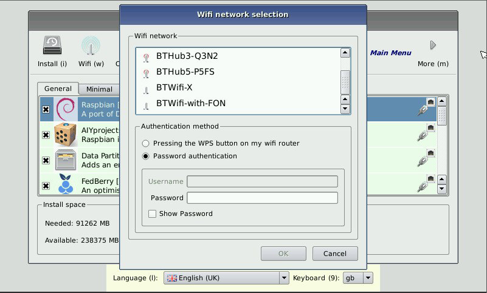

PINN will remember your wifi network connections, so it is only necessary to enter them once. Some operating systems, like Raspbian, will copy these  wifi connections when they install, so they will also be able to use them as soon as they are booted.

### Preconfiguring a WiFi network

If you already know your WiFi details, you can preconfigure PINN to use them straight away. Put a copy of your `wpa_supplicant.conf` file on the PINN root partition and PINN will read it and store it in its settings for all future uses. The file will be renamed to `wpa_supplicant.conf.bak` to prevent it from overwriting any subsequent changes you make to the Wi-Fi networks using the GUI. This file will also be passed on to some OSes when they install.

### Network Drivers

From v1.9.4, the following network drivers have been added to support a wider range of Wi-Fi and network adapters:
* zd1211rw
* rtl8192cu - fixed in v1.9.5
* rt2500usb
* rt73usb
* rt2800usb
* mt7601u
* rtl8150
* r8152
* asix
* ax88179_178a
* dm9601
* smsc95xx

from v2.0
* rtl8188eu - for hubpiwi and others
from v2.1
* IoTpHAT

### Enabling SSH for Raspbian

In recent Raspbian releases, SSH has been disabled by default for security reasons. To override this and enable SSH from first boot, it is necessary to create a file called `ssh` or `ssh.txt` in the Raspbian boot partition. If PINN detects such a file in the PINN recovery partition, it will copy it across to the Raspbian boot partition whenever it is installed, enabling SSH to be enabled immediately, which is very useful especially for headless installs.

NOTE: this file does not enable SSH access to PINN. To enable that the 'ssh' keyword must be added to `recovery.cmdline`.

### How to change the default Language, Keyboard layout, Display mode, or Boot Partition etc.

Edit the `recovery.cmdline` file in the root PINN directory and append the following arguments where relevant:
- `lang=<two-letter language code>` (e.g. `lang=de` or `lang=en`)
- `keyboard=<two-letter layout code>` (e.g. `keyboard=de` or `keyboard=us`)
- `display=<display mode number>` (e.g. `display=1` or `display=3`)
- `partition=<partition_number>` (e.g. `partition=6`)
- `showall` (shows all available OSes regardless of your Raspberry Pi model)

Note that these defaults will be overwritten by any changes made in the GUI to these settings.

## Cmdline Options

The following is a complete list of all the PINN options that can be added to the `recovery.cmdline` file on the PINN recovery partition to affect its operation:

- **runinstaller**: This option is present when PINN is first installed to cause it to reformat the SD card. Once reformatted, PINN will delete this option. Manually adding it back in will cause PINN to reformat the SD card on next boot, losing any and all installed OSes, so be careful!

- **vncinstall**: Uses a VNC network connection to control PINN instead of any locally attached keyboard, mouse and display. When this is used, any local display will remain blank.

- **vncshare**: Uses a VNC network connection to control PINN. However, unlike `vncinstall`, any locally attached keyboard and mouse will still be active and the display will be duplicated to the local screen and the VNC connection.

- **ssh**: Enables an SSH connection to the rescueshell in PINN. It cannot be used to control PINN, but having a shell is very useful to perform remote maintenance on any of the SD card partitions.

- **rescueshell**: This option causes a local command shell to be opened when PINN is booted. When the shell is exited, PINN will then be booted as normal. Alternatively, inserting a physical jumper between pins 5 & 6 of GPIO header P1 will cause the rescueshell to be entered as well. 

- **lang=\<country code\>**: Sets the langauge to be used by PINN

- **keyboard=\<country code\>**: Sets the keyboard code to be used by PINN

- **display=\<1|2|3|4\>**: Sets one of 4 simple display modes

- **partition=\<part number\>**: Sets the default partition to be booted if no input is detected.

- **forcetrigger**: Forces the PINN interface to be entered on startup (as if the shift key had been pressed). This is very useful when using a VNC connection.

- **gpiotriggerenable**: Forces Recovery Mode to be entered on boot if GPIO pin 3 on header P1 is connected to GND (pin 25). 

- **keyboardtriggerdisable**: Prevents a `SHIFT` keypress from entering Recovery Mode on boot (maybe you have a problematic keyboard which is erroneously triggering every time you boot)

- **disablesafemode**: If you have external hardware or an addon board connected to the GPIO header, you may find that pin 5 is being pulled low and accidentally triggering "Safe Mode" by entering the rescueshell. To prevent this, you can append `disablesafemode` to the `recovery.cmdline` file.

- **silentinstall**: Allows a single OS to be installed automatically, useful during headless installs.

- **alt_image_source=\<url\>**: Provides the URL of an additional os_list_v3.json file indicating the location of other OSes that can be downloaded from the Internet. Multiple instances of this option can be used.

- **repo_list=\<url\>**: Provides the URL of a repo_list.json file that contains a list of URLs to other os-list_v3.json files. This allows easy remote management of Internet respositories.

- **repo=\<url\>**: Matches the NOOBS method of specifying a list of additional respositories.

- **no_default_source**: Prevents the default RaspberryPi Foundation repository from being used.

- **disableusbimages**: Prevents OSes stored on local USB memory devices from being used.

- **no_group**: Prevents the list of OSes from being grouped into categories.

- **no_cursor**: Prevents the cursor from being shown on the screen (requested for touchscreen devices)

- **showall**: Shows all available installable OSes, whether they are suitable for the current model of Pi or not. Useful for preparing SD cards to be used in other RPis.

- **bootmenutimeout=\<time in secs\>**: Changes the default timeout allowed before an OS is booted without any selection.

- **noobsconfig**: Prevents any noobsconfig customisations from being applied to an OS on installation

<!-- fixate not documented -->

- **dsi**: A special boot feature to swap the priority of the DSI and HDMI video outputs, allowing an OS to give priority to a HDMI screen if attached.

---

# Installing OSes

## OS Installation

Simply select the checkbox next to each OS you want to install, using either a mouse or keyboard (use the arrow keys to traverse the list; the Enter or Space key to toggle the selected OS's checkbox), then click the "Install" icon (or press "i" on your keyboard) to install the selection. The icons shown on the right of the list indicate whether the OS is being installed from the SD card (SD card icon), USB device (USB icon) or from the online OS repository (Ethernet icon).

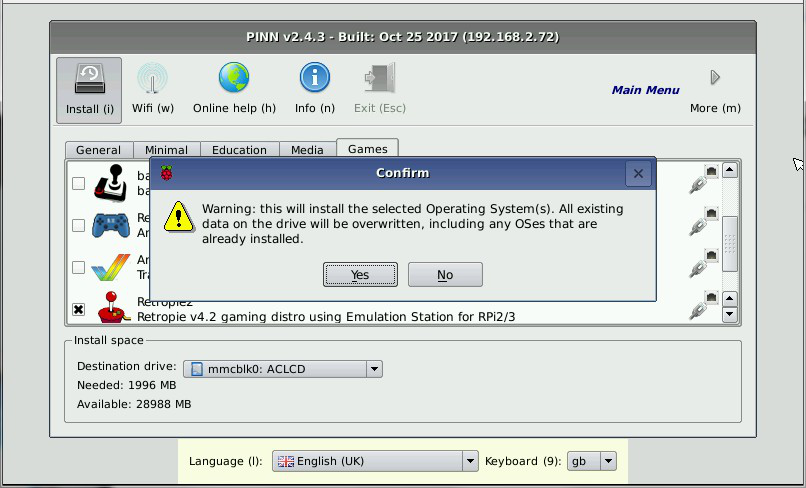

<sup>*NOTE: The list of OSes in this image is indicative only. It will vary according to your Raspberry Pi model and the availability of OSes on the installation sources.</sup>

## OS Network Installation

PINN allows additional operating systems to be downloaded from a remote repository. To do this, the Raspberry Pi must be connected to a wired network, or it can connect over Wi-Fi using the [Raspberry Pi USB wifi dongle](https://www.raspberrypi.org/products/usb-wifi-dongle/) or the Raspberry Pi 3 Model B built-in Wi-Fi.

Once connected, the Pi will only show a list of operating systems that are appropriate to your Pi Model. If you want to see _all_ available OSes, edit the `recovery.cmdline` file in the root PINN directory and append `showall` to the arguments list.

Once PINN has connectd to your network, the IP address of the PI is shown in the window title bar.

### How to install OSes from an alternative network sources

If your Pi is connected to the Internet, PINN will present a list of OSes that are available for installation from the internet. By default, this list includes all of those available through the Raspberry Pi website, plus some others that have been converted specifically for PINN through the repo_list cmdline option.

PINN provides many options to customise the list of repositories that it will use for sources of OSes by using the following recovery.cmdline options:

- If no specific cmdline option is given, PINN will use the list on the Raspberry Pi Website.

- **no_default_source** will prevent the OSes on the Raspberry pi website from being used.

- **alt_image_source=** specifies an alternative source of OSes that can be installed from the internet. For example: <b>alt_image_source=http://newurl.com/os_list_v3.json</b> where `newurl.com` is the name of the alternative server and `os_list_v3.json` is the list of information about the alternative OSes. This list of OSes will be added to the default download list. This can be useful for storing the default repository on a local LAN server, or for adding your own list of OSes to those available in PINN. Multiple alternative repositories can be specified by including this option multiple times with different URLs.

- **repo=** option from NOOBS is supported by PINN. Using `repo` will replace the default RPF server repository, whereas `alt_image_source` simply adds a repository. To add multiple repositories add multiple space-separated urls to the single "quoted" repo option.

- **repo_list=** is used by default as it is a convenient way to support multiple repsositories by specifying one URL that points to a JSON file containing a list of other repositories. This makes it easier to maintain the OS list remotely for a set of users, rather than editing it manually on each Pi. For testing purposes, including a `repo_list.json` file on the PINN recovery partition will override any cmdline option and will be read instead.

## Local Images on SD card

PINN can install local images that are found in the `/os` folder on the SD card. These can include any of the original NOOBS images or any other OS that is formatted with a `.tar.xz` file for each partition.

Whilst this can be a convenient way to host the installable images as they can be installed offline, it does take up some valuable SD card space, so installing from USB is often better.

The easiest way to put OS installation images on the SD card is to first [download](#Download) them to a USB stick and then copy the appropriate folder from the USB drive to the SD card.

Make sure to add any OSes to the `/os/` folder before you boot PINN in a RPi for the first time. Otherwise you will find the partition has been shrunk to its minimum size and there will be no room to add any more OSes to the card later.

## Local Images on USB stick

Due to the increasing size of OSes, it is becoming increasingly difficult to store their compressed installation files on the PINN SD card. PINN-lite contains no OS installation files by default, but you can copy selected OSes into the `/os` folder if you wish.

To counter this lack of SD card space, PINN supports storing the compressed OSes on a USB stick as well. This has the following advantages:

 1. The OSes are available to install when a network is not available.
 2. They do not take up any valuable space on the SD card.

The OSes should be stored on the USB stick in the same format as they would be on a PINN SD card (please see the [download](#Download) section):

 1. Each OS should be stored in its own folder beneath the `/os` folder.
 2. They should contain compressed images of their partitions in `.tar.xz` format
 3. All supporting JSON files (etc.) should also be included.

If the same OS is available on the SD card, the USB stick, and the network, only the most recent version will be displayed.

## Installing TO a USB device

There are three ways for PINN to install an OS, which also depends on the RPi model you have:

1. Install to the SD card
2. Install the boot partition to the SD card and the rootfs to the USB device
3. Install the boot and rootfs partitions to the USB device.

_NOTE: PINN can only install the boot partition of an OS to the same drive that PINN is stored on. So for option 3, the USB drive must have PINN installed on it and the Pi must be booted from this drive._

### Option 1: Install to the SD card

This is the normal way to use PINN. PINN is stored on the SD card, is booted and installs the OSes to the remainder of the space on the SD card.

### Option 2: Boot on SD card, Rootfs on USB

There are several reasons why you may want to install an OS to a USB memory device: more capacity, more resilience, faster read/write operation and so on. PINN allows the rootfs to be installed to a USB memory device. However, the boot partition is kept on the SD card, so this technique is applicable to all RPi models.

1. Follow the basic instructions to format your SD card and install PINN on it.
2. Boot your Pi with the PINN SD card.
3. Insert a USB memory device (USB stick, hard disk etc) into the Pi). Make sure it has nothing of value on it because it will be erased and reformatted.
4. Select the new USB device in the dropdown box in the lower status window as the drive to install to and you will be prompted to format the device. Select Yes to continue.
5. Install the OSes you require as normal.

Using this technique you will always need to boot from the PINN SD card.

### Option 3: Boot and Rootfs on USB

This option is only applicable to RPi models based on the BCM2837 chipset (RPi3B and RPi2Bv1.2) which have the facility to boot directly from a USB device. However this mode must be enabled first, which can be done by following the instructions at: https://github.com/raspberrypi/documentation/blob/master/hardware/raspberrypi/bootmodes/msd.md

Once USB boot mode is enabled, proceed as follows:

1. Format the USB device as FAT 32 and copy the PINN files to it, just as you would for a normal PINN installation on an SD card.
2. Boot PINN on the Pi from the USB device.
3. Install your requried OSes as normal.

## How to Automatically Install an OS

Even if you are using your Pi without a display, you can still use PINN to easily install an OS of your choice. To set up PINN to install a specific OS automatically and silently (i.e. without requiring any user input), follow these steps:

1. Copy the OS folder for the OS you want to install into the `/os` dir (alternatively, delete all other OSes contained in the `/os` dir so that only your chosen OS remains).
2. If the OS you want to automatically install has multiple flavours available, edit the `flavours.json` file so that it only contains the entry for the flavour that you want to install.
3. Edit the `recovery.cmdline` file in the root PINN directory and append `silentinstall` to the arguments list.

When you now boot your Pi using an SD card containing the modified version of PINN that you just created, it will automatically install the OS you chose and boot into it after the installation has finished.

## Installer Slideshow

An installer slideshow guides you through your first steps with each OS while it installs.

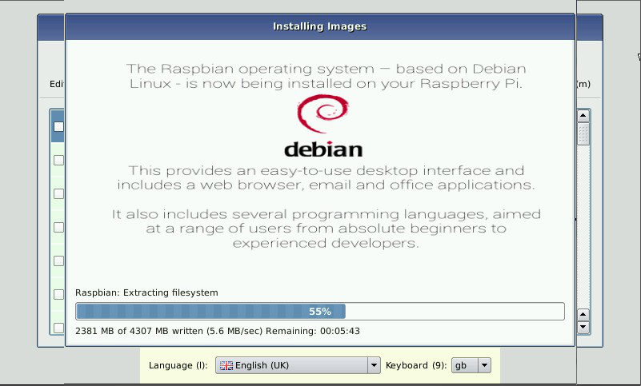

## Installation Progress

During the installation of the operating systems, PINN will write the percentage completed to a text file called `/tmp/progress`. The format of this file is an integer (0-100) followed by a space, a '%' symbol, and a line feed. It is only updated when the progress changes by at least 1%. Sometimes PINN will not know the maximum size; in this case, it shows the amount data written in MBs.
This feature mimics the progress dialog on the display and is useful in headless setups to monitor the progress of the installation.

## Background shell script

To make use of the installation progress feature, a background shell script can be used. If a `/background.sh` script exists, it will be executed in the background whilst PINN runs. This can be used to read the `/tmp/progress` file and display the progress on the serial port, a GPIO-based display, etc. amongst other things.


---

# Booting an OS with PINN

There are several ways of controlling the boot process and determining which OS gets booted. 

When PINN is booted, it displays a splash screen which provides enough time for the user to interrupt the boot process and go to the PINN recovery mode. The user may press the shift key, touch the logo on the touchscreen, press the left mouse button, or any recognised TV remote button when using the CEC interface to interrupt the boot process.

The recovery mode will also be entered if no OSes have been installed, the `forcetrigger` is used or the GPIO trigger is used. Otherwise PINN will continue to boot one of the installed OSes

## Booting a single OS

If only one OS is installed, the boot selector will not be displayed and the OS will boot automatically.

## OS Boot Selector

After multiple OSes have been installed, a boot selection dialog is presented to list all the installed OSes for the user to choose one to boot. PINN will remember this OS choice and boot this OS by default each time unless a different option is selected within a timeout of 10 seconds. It is possible to change this menu timeout by adding `bootmenutimeout=X` in the `recovery.cmdline` file, where `X` is the desired timeout in seconds.

A Boot button has been added for easier selection with limited CEC TV remotes, mice or touchscreens.

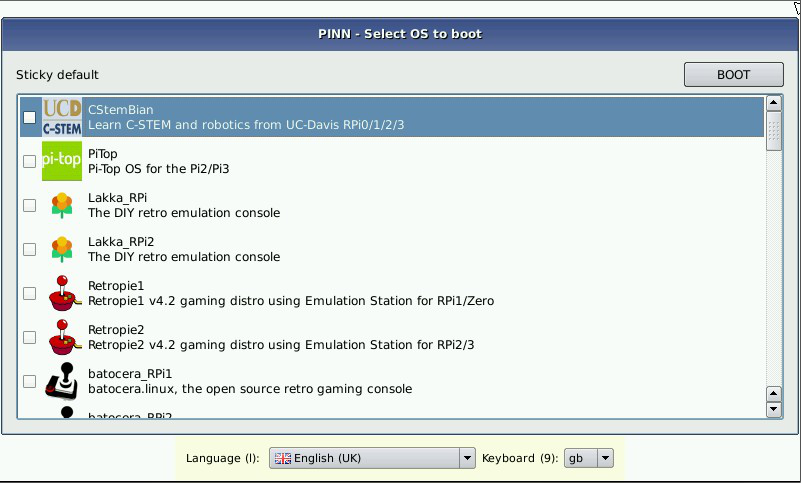

## Sticky Default OS

Each OS entry in the boot selection dialog has a checkbox next to it, allowing users to select it as a sticky default OS. If an OS is checked, PINN will operate as if that were the only OS installed (booting it automatically, without showing the boot selection dialog). This permits a slightly faster boot up time when one OS is used regularly. 

To change or remove the sticky checkbox, or just to temporarily boot into another IS, the boot selection dialog can be shown again by pressing the Shift key on boot up and entering the recovery mode.

### Reboot shell script

Just before PINN boots into the selected OS, it will execute 
`/before-reboot.sh` if it exists. A typical example for this script is to turn off the backlight of the Raspberry Pi 7" touch screen display. Be aware that any such script here must execute and finish before PINN will continue to boot the selected OS.


## How to bypass PINN and boot directly into a fixed partition

PINN provides many administration functions to assist you in installing, maintaining and booting multiple OSes. But to do this, it does slow the boot process down a little to allow time for the user to interact with the boot process. But even if you have installed multiple OSes, there may be times when you would like the Pi to always boot into one specific OS as quickly as possible and hide PINN completely.

After you have installed your chosen OSes, add the following file to the root directory of PINN to force a specific OS to be booted each time.

1. Add a text file named `autoboot.txt` to the root directory of PINN.
2. Add `boot_partition=<partition number>` to the file and save it to disk.

The <partition_number> is the partition number of the boot partition of the OS you want to boot at each power on. The partition number can be found by running `sudo fdisk -l` the partition will be one of the FAT32 partitions `/dev/mmcblk0p6` would be partition 6. It can also be found by looking at the installed_os.json file ont he settings partition (partition 5) of the device that PINN is installed on. This will also prevent the splashscreen from being displayed at boot. 

NOTE: that once an `autoboot.txt` file is present, there's then no way to force the PINN GUI to display, until you delete (or rename) the `autoboot.txt` file. The SD card behaves as is PINN were not there at all.

---

# Other Features

## Online Help via Web Browser

The built-in Arora web browser allows you to easily get help via the Raspberry Pi Forums (network connection required).


## Info on OS

The Info button will take you to the web page specific to the currently highlighted OS in the selection list (network connection required).

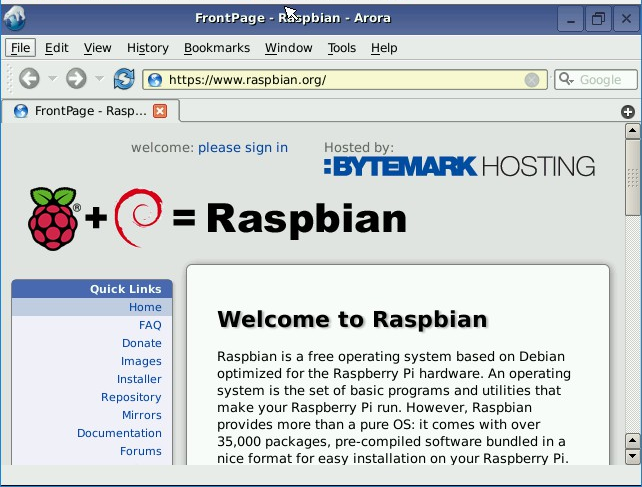

## Exit

The Exit button (Esc) will exit recovery mode and go to the boot selection dialog, or directly boot the OS if only one is installed.

---

# Archival Menu

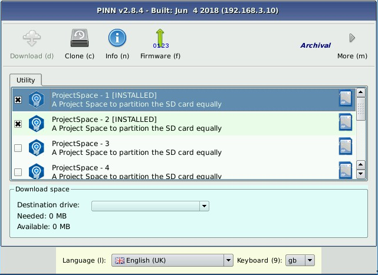

## Download

As documented earlier, PINN can install an OS from a local USB disk instead of directly from the internet for use when no internet is available, or to avoid repetitive slow or costly downloads. But to do this, the OS and is accompanying meta-files must be downloaded from the internet to the USB drive. PINN's `download` feature allows this task to be done easily. It will only download OSes that are sourced from the network - selected OSes on a USB stick, for example, will be ignored.

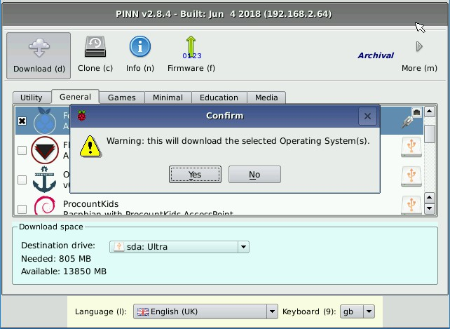

1. Format a USB drive as FAT32 and create a `/os` folder on it.
2. Insert the USB drive into the Pi.
3. On the Archival Menu, select the USB drive in the status window.
4. Select the list of OSes you want to download
5. Select the Download button and wait for the OSes to download.
6. Once download is complete, you will be prompted to reboot PINN for it to recognise the new OSes on the USB stick.

The download icon is only available when the download size of all files are known. If the download icon is greyed out, and the toolbar indicates that that there are still more files to check, please wait until all files are checked. 

## How to Clone an SD Card

Raspbian has added an SD Card Copier tool called `piclone`, which is great. For anyone concerned about it cloning a live system, 
it has now been ported into PINN so that it can clone the SD card offline, whilst the OS is not running. 

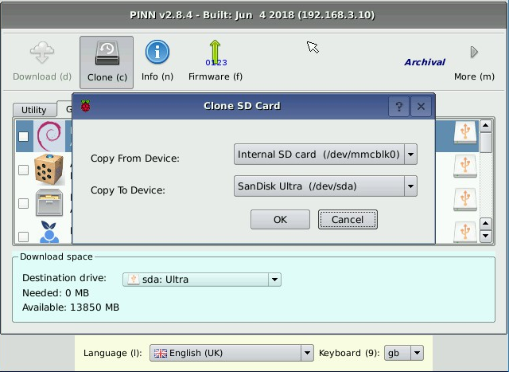

1. On the PINN screen, select the new `Archival` toolbar by pressing the `More` button.
2. Insert a second SD card into the Pi using a USB card reader.
3. Select the Clone SD card button.
4. Select your internal SD card as the source (/dev/mmcblk0) and the SD card in the USB reader as the destination (usually `/dev/sda`).
5. Select OK to clone your SD card.

All partitions will be copied onto the second card whilst the last partition will be sized to fit the remainder of the SD card. 
In this way, your existing data can be migrated to a smaller or larger SD card.

_Note: that if you have installed multiple OSes using PINN, only the last partition of the last OS on the SD card will be resized._

---

# Maintenance Menu

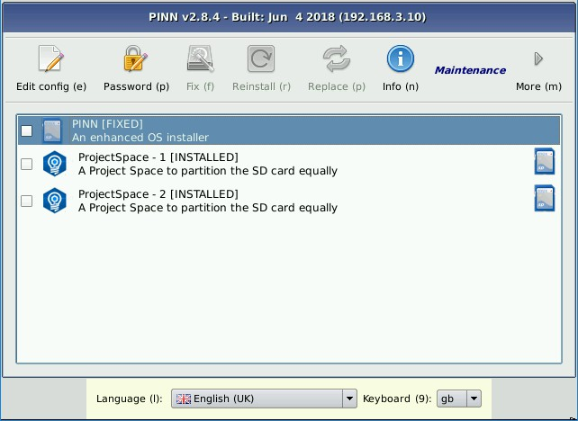

The maintenance toolbar contains commands to execute on installed OSes only, so the main window will only show a list of those OSes that are installed.

The first entry is a dummy fixed entry called `PINN` which represents the PINN recovery partition. This enables the same toolbar commands to be carried out on the PINN recovery partition, such as doing a file system check or editing recovery.cmdline or config.txt files. Of course, changing the password will have no effect.

<!-- backup -->

<!-- Restore -->

## Easy Config File Editor

The built-in config file editor allows you to edit the config file of the OS that is currently highlighted in the OS list. This allows you to easily add license keys to different OS installs through the same interface. When the PINN entry is selected, it allows you to edit the recovery.cmdline instead of the cmdline.txt file.

Note that the output mode selected by the user through pressing one of number keys 1 to 4 (for HDMI preferred, HDMI VGA, Composite PAL, and Composite NTSC, respectively), will be automatically set in the `config.txt` files of your installed OSes. This means that you shouldn't have to worry about manually changing your display settings to get your installed OS to display correctly on your display device.


## How to Recover from a lost password

If you have changed your login password for an OS and forget what it is, PINN will allow you to reset it back to its default or set it to a new value.

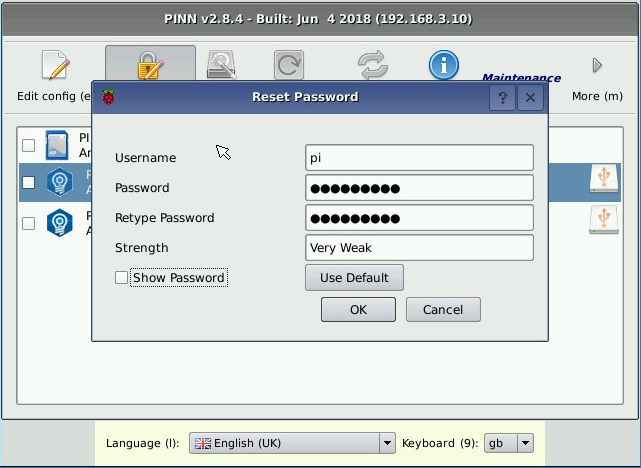

1. On the PINN screen, select the new `Maintenance toolbar` by pressing the `More` menu.
2. highlight the installed OS that you want to reset the password in.
3. Selecting the Password button will display a dialog box to enter the new password details.
4. Enter the username you want to change the password of.
5. Enter the new password (twice). Both copies must match. The second will be displayed red if it is different.
6. The password strength meter is a useful indication of how good a password you have created.
7. The `Use Default` button will enter the default username and password for the selected OS.
8. Tick the `show password` box to display the passwords on the screen.

## How to Check an OS's File Systems

Most RPi OSes typically delay writing any data back to SD or USB drives for performance reasons. Normally, this does not cause a problem provided the Pi is shutdown properly before removing the power, but this is not always possible. You may experience a power loss, or a program crash where pulling the power is your only recourse to recovering control. In these circumstances there is a risk that the SD card or USB drive may become corrupted if some data failed to get written to the drive before the power was lost. 

To recover from a corrupted drive, PINN includes a file system check (fsck) option which will perform an `fsck -y` command on all partitions of the selected installed OSes. The output of the `fsck` command will be shown in a dialog box that can be scrolled to check the result. If it shows that recovery was unsuccessful, you may need to use more advanced disk recovery tools to fix the problem. Since this check option will work on multiple OSes, it is necessary to select the checkbox of each OS you want checked, otherwise no OSes will be checked. If you are paranoid, you may want to make a backup of any affected partitions before trying this fsck option.

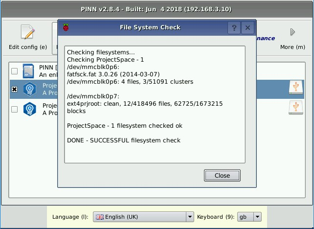

## Wipe the Drive

This option will wipe your drive of all installed OSes by deleting all the OS partitions and restore its capacity to full size by expanding the first partition to the whole disk size, 
but PINN will remain on the card. This allows you to manually copy additional OS distribution files to the /os folder from a USB stick, for example.

After wiping a drive, the Install and Download buttons will no longer work since the drive is no longer in the correct format. 

This function also adds the `runinstaller` option to the recovery.cmdline file, so on next boot of this card, the full PINN partition structure will be restored allowing OSes to be installed or downloaded again.


---

# Advanced Usage

## How to create a custom OS version

There are two main use cases for which you may want to create a custom version of one of the standard OS releases that is suitable for installation via PINN:
- If you are a teacher wanting to easily deploy a custom OS release containing pre-defined set of packages and files onto a number of SD cards (e.g. to provision a class set of Raspberry Pi's or quickly restore a Raspberry Pi back to custom "factory" settings).
- If you want to be able to back up your existing installed packages and files so that any future OS re-install does not force you back to a clean install.

The following steps allow you to create a modified copy of one of the standard OS releases that contains your custom files, packages and settings.

1. Download a base version of PINN from http://downloads.sourceforge.net/projects/pinn/pinn-lite.zip.
2. Extract the PINN-lite zipfile.
3. Navigate to the `os` directory.
4. Create a copy of the folder containing the OS release that you want to modify and rename it with a custom name.
5. Edit the following fields in the `os.json` file contained in the folder that you just created:
  * "name" - replace the name of the base OS with the name of your custom OS version
  * "description" - replace the description of the standard OS install with one for your custom OS version
6. [Optional] Rename or replace the existing `<OS>.png` icon file with one matching the name of your custom OS version.
7. [Optional] Replace the PNG image files in the `slides` and `slides_vga` directory with your own custom installer slides.
8. Edit the following fields in the `partitions.json` file contained in the folder that you just created:
  * "partition_size_nominal" - replace the numerical value with the size of the paritions in your custom OS version
  * "uncompressed_tarball_size" - replace the numerical value with the size of your filesystem tarballs when uncompressed
9. Replace the `.tar.xz` root and boot filesystem tarballs with copies created from your custom OS version (these instructions assume you're only using a single OS at a time with PINN - they won't work if you're running multiple OSes from a single SD card). The name of these tarballs needs to match the labels given in `partitions.json`.
  * To create the root tarball, you will need to run: `sudo bsdtar --numeric-owner --format gnutar --one-file-system -cpf \<label\>_root.tar ` from within the root filesystem of your custom OS version. You should then compress the resulting tarball with `xz -9 -e \<label\>_root.tar`.
  * To create the boot tarball, you will need to run `sudo bsdtar --numeric-owner --format gnutar -cpvf \<label\>_boot.tar .` from the boot partition of your custom OS version. You should then compress the resulting tarball with `xz -9 -e \<label\>_boot.tar`.

_More detailed instructions are available in the Wiki at https://github.com/procount/pinn/wiki/How-to-Create-a-Multi-Boot-SD-card-out-of-2-existing-OSes-using-PINN_

## How to customise an OS install (noobsconfig)

PINN can be used as a recovery program, so if your OS gets corrupted, messed up, or otherwise goes wrong, you can reinstall a clean version of the OS and start again. On the other hand, starting again from scratch can be painful, especially if you can't remember how you set up your perfect OS environment.

Creating a custom OS version (see above) for your preferred setup is one option, but it can look daunting to do, and would need to be repeated if you want to update it to include the latest build of the OS.

[Noobsconfig](http://github.com/procount/noobsconfig) is an alternative option that creates a customised OS by installing a standard OS, but then copies your own files over the top to add your own customisations according to your selected "flavour". These additional files are specified in a simple text file that controls their installation. For example, these can be simple configuration files, workshop exercises, tutorials, or Wi-Fi setup files. Alternatively, they could be scripts that are configured to run on first boot to further configure your OS by automatically installing your favourite packages.

By keeping the customisations separate from the OS distro means:

1. A custom installation can be created out of a standard OS installation plus some additional files, without having to create a full customised OS.
2. The same customisations can be applied to a newer version of the standard OS installation without having to rebuild a custom OS installation.
3. By using simple configuration files, it is easy to add files to configure your OS.
4. Different customisation "flavours" of an OS can be created as a master installation card, and the required ones can be selected and installed as required. This can save a lot of SD card space compared to storing a different full customised OS for each flavour.

PINN now includes direct support for `noobsconfig`, so it is no longer necessary to add the `noobsconfig` files to your PINN installation. Just add your configuration and customisations files and install your "flavoured" OS. Please see (https://github.com/procount/noobsconfig) for full documentation on how to use this feature.

The [PiKitchen](http://www.pihardware.com/guides/pi-kitchen) is an example of how comprehensive these configurations can be if you want them to be.

## How to auto-switch HDMI/DSI screen configurations

If an HDMI and a DSI screen (such as the Raspberry Pi Touch Screen) are both connected to the Raspberry Pi, the selection of which screen is to be used as the default needs to be selected in the `config.txt` file, which means constantly having to change `config.txt` to match whichever screen is required. This is because the DSI screen can only be selected at boot time, although without *any* configuration, the GPU will select the DSI screen in preference to the HDMI. PINN provides some limited ability to reverse this priority. 

This use case assumes that the DSI screen is always connected, and is normally used. But if an HDMI screen is connected, then the display will automatically switch to it. 

1. Create a `config.txt` file in the PINN root partition. Ensure it has the line `ignore_lcd=1` to disable the DSI screen and select the HDMI screen.
2. Edit `recovery.cmdline` and add the `dsi` keyword.
3. In the boot partition of any installed OS, create a `config.dsi` file to configure the DSI screen, and a `config.hdmi` file to configure the hdmi screen. (This can mostly be setup using a custom flavour with the `noobsconfig` feature so it can be installed automatically.)

When PINN boots, the HDMI screen will be selected, so to use any PINN feature, an HDMI screen **must** be connected. 

PINN will automatically boot the last selected OS after it times out. If a HDMI screen is attached, PINN will copy the `config.hdmi` file to `config.txt` on the selected OS and reboot into it.

If an HDMI screen was not detected, PINN will copy the `config.dsi` file to config.txt on the selected OS and reboot into it.

When using this technique, do not make any modifications to config.txt directly otherwise they will be overwritten bny PINN on next boot. Instead, modify the appropriate config.dsi or config.hdmi file.

---

# Troubleshooting

## What to do if your SHIFT keypress isn't detected

Try pressing shift only when the grey splash screen is displayed, rather than holding it from boot up.

## How to force Recovery Mode being entered on boot (overrides GPIO or keyboard input)

Alternatively, if you are unable to use either the GPIO or keyboard to trigger entering Recovery Mode, you can:

1. Append `forcetrigger` to the argument list in the `recovery.cmdline` file which is found in the root PINN directory.
2. Reboot.

Note that with this option enabled, the Recovery Mode will be displayed <b>every</b> time you boot from your PINN card (until you edit `recovery.cmdline` again).

## How to disable using the keyboard to trigger entering Recovery Mode

In some rare cases, you may find that PINN incorrectly detects a `SHIFT` keypress from your keyboard regardless of the presence of user input. In such cases it may be helpful to disable using the keyboard to trigger Recovery Mode being entered.

To prevent a `SHIFT` keypress from entering Recovery Mode on boot (maybe you have a problematic keyboard which is erroneously triggering every time you boot), you can:

1. Append `keyboardtriggerdisable` to the argument list in the `recovery.cmdline` file which is found in the root PINN directory.
2. Reboot.

## How to enable using the GPIO to trigger entering Recovery Mode

To force Recovery Mode to be entered on boot and to show the PINN interface, you normally press the `SHIFT` key during bootup. If you don't have a keyboard or the `SHIFT` keypress isn't being detected, you should complete the following steps to force the PINN interface to be displayed on boot:

1. Append `gpiotriggerenable` to the argument list in the `recovery.cmdline` file which is found in the root PINN directory.
2. Reboot.

To force Recovery Mode being entered on boot, connect GPIO pin 3 on header P1 to GND (pin 25). If GPIO pin 3 remains unconnected then it will boot through to the installed OS as normal.

## How to boot into "Safe Mode"

To boot into a basic busybox shell rather than launching the PINN GUI, you can *either*:

1. Append `rescueshell` to the argument list in the `recovery.cmdline` file which is found in the root PINN directory. Exiting from this shell will now enter the PINN recovery program.
2. Insert a physical jumper between pins 5 & 6 of GPIO header P1. If you have external hardware or an addon board connected to the GPIO header, you may find that pin 5 is being pulled low and accidentally triggering "Safe Mode". To prevent this, you can append `disablesafemode` to the argument list in the `recovery.cmdline` file (which is found in the root PINN directory).

## Debug Information

PINN produces a debug log which can be helpful if something goes wrong. Please see the [troubleshooting guide](https://github.com/procount/pinn/wiki/Troubleshooting) in the wiki on how to access this and waht to do if you suspect a bug.

---

# FAQ

---

# How to Rebuild PINN

Note that this will require a minimum of 6 GB free disk space.

## Get Build Dependencies

On Ubuntu:

`sudo apt-get install build-essential rsync texinfo libncurses-dev whois unzip bc qt4-linguist-tools`

## Run Build Script

`./BUILDME.sh`

Buildroot will then build the software and all dependencies, putting the result in the `output` directory.

By default, buildroot compiles multiple files in parallel, depending on the number of CPU cores you have.

If your build machine does have a quad core CPU, but relatively little RAM, you may want
to lower the number to prevent swapping:
- `cd buildroot ; make menuconfig`
- "Build options" -> "Number of jobs to run simultaneously"

If your build machine also has some QT5 components, it is useful to `export QT_SELECT=4` before building to ensure the QT4 component versions are selected.

## How to run your Build

In order to set up an SD card with a newly built version of PINN, you will need to:
- Format an SD card that is 8GB or greater in size as FAT32.
- Replace the `/os` directory in `/output` with the copy contained in the release version of PINN (see above for download links).
- Copy the files in the `/output` directory onto the SD card.

## About the Buildroot infrastructure

To add extra packages: `cd buildroot; make menuconfig`

Recovery software packaging is in: `buildroot/package/recovery`

Kernel configuration used: `buildroot/kernelconfig-recovery.armv6` and `kernelconfig-recovery.armv7`

Main differences with `bcmrpi_defconfig`:
- `CONFIG_BLK_DEV_INITRD=y` - initramfs support
- `CONFIG_INPUT_EVDEV=y` - evdev support built-in
- `CONFIG_USB_HID=y` - usb HID driver built-in
- All modules disabled.
- (This has changed significantly from v1.5 to use a squashfs)

## Modifying Qt source

Source is in the `recovery` folder.
Be aware that user interface screens will appear larger in Qt Creator than when deployed on the Pi. You can
raise the font sizes 2 points to compensate for this.

Several constants can be changed in `config.h`.

Wrap code that calls Qt Embedded specific classes (such as QWSServer) between
```C
#ifdef Q_WS_QWS
```
and
```C
#endif
```
so that the project also compiles and can be tested under standard Qt.

## Adding/Updating Translations

References:

http://qt-project.org/doc/qt-4.8/i18n-source-translation.html

http://qt-project.org/doc/qt-4.8/linguist-manual.html

To set up a git pre-commit hook to automatically update the translation files, run the following commands in the project root:
- `chmod +x pre-commit-translation-update-hook.sh`
- `cp pre-commit-translation-update-hook.sh .git/hooks/pre-commit`

To add a new translation:
- Add to `recovery/recovery.pro` the following: `TRANSLATIONS += translation_<languagecode>.ts`
- Run `lupdate recovery/recovery.pro` which extracts strings from the source code and generates/updates the *.ts* files.
- The *.ts* can then be sent to the translator, opened in Qt Linguist and filled in.
- Add a line for the *.ts* file in to `recovery/icons.qrc`, but substitute *.ts* extension with *.qm* . This file contains a list
  of resource files that will be embedded into the application's executable during build.
- Add a flag icon for your language from http://www.famfamfam.com/lab/icons/flags/ flag icon collection or if it
  doesn't have the one you need, you may use some other small png icon for it. Copy the icon file to the `recovery/icons`
  folder and add a line for it into `recovery/icons.qrc` as well.


### Legal compliance

Copyright (c) 2013, Raspberry Pi
All rights reserved.

Redistribution and use in source and binary forms, with or without modification, are permitted provided that the following conditions are met:

Redistributions of source code must retain the above copyright notice, this list of conditions and the following disclaimer.
Redistributions in binary form must reproduce the above copyright notice, this list of conditions and the following disclaimer in the documentation and/or other materials provided with the distribution.
Neither the name of the Raspberry Pi Foundation nor the names of its contributors may be used to endorse or promote products derived from this software without specific prior written permission.
THIS SOFTWARE IS PROVIDED BY THE COPYRIGHT HOLDERS AND CONTRIBUTORS "AS IS" AND ANY EXPRESS OR IMPLIED WARRANTIES, INCLUDING, BUT NOT LIMITED TO, THE IMPLIED WARRANTIES OF MERCHANTABILITY AND FITNESS FOR A PARTICULAR PURPOSE ARE DISCLAIMED. IN NO EVENT SHALL THE COPYRIGHT HOLDER OR CONTRIBUTORS BE LIABLE FOR ANY DIRECT, INDIRECT, INCIDENTAL, SPECIAL, EXEMPLARY, OR CONSEQUENTIAL DAMAGES (INCLUDING, BUT NOT LIMITED TO, PROCUREMENT OF SUBSTITUTE GOODS OR SERVICES; LOSS OF USE, DATA, OR PROFITS; OR BUSINESS INTERRUPTION) HOWEVER CAUSED AND ON ANY THEORY OF LIABILITY, WHETHER IN CONTRACT, STRICT LIABILITY, OR TORT (INCLUDING NEGLIGENCE OR OTHERWISE) ARISING IN ANY WAY OUT OF THE USE OF THIS SOFTWARE, EVEN IF ADVISED OF THE POSSIBILITY OF SUCH DAMAGE.

#### Third party licenses:

Recovery software directly links to:
- Qt libraries, available under LGPL and commercial license.

Currently used icon sets:
- http://www.fatcow.com/free-icons - Creative commons Attribution license
- http://www.famfamfam.com/lab/icons/flags - "These flag icons are available for free use for any purpose with no requirement for attribution."
- http://www.oxygen-icons.org/ - Available under Creative Common Attribution-ShareAlike 3.0 and LGPL license

Licenses of utility software build by buildroot:
Type `cd buildroot ; make legal-info` to generate a list, which will be available under `output/legal-info`.
